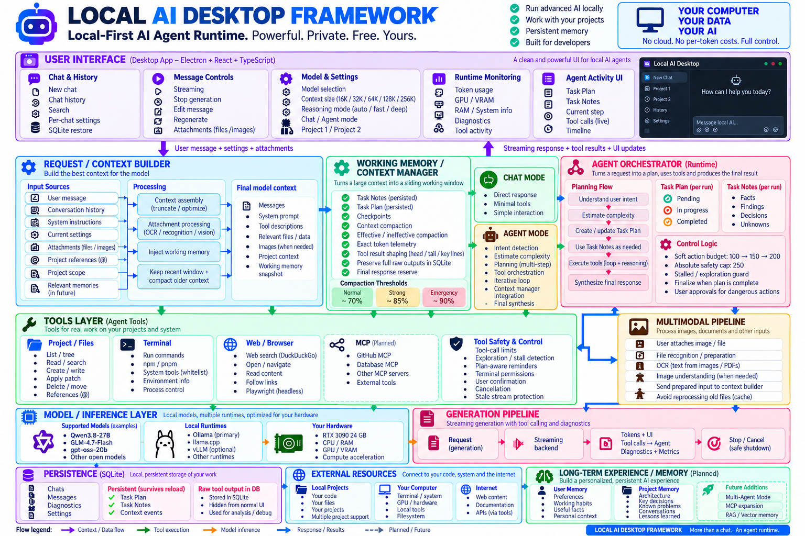
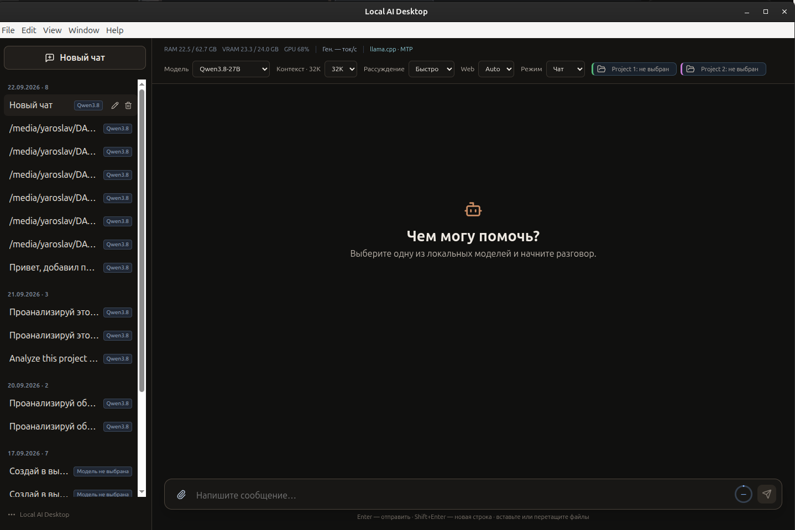
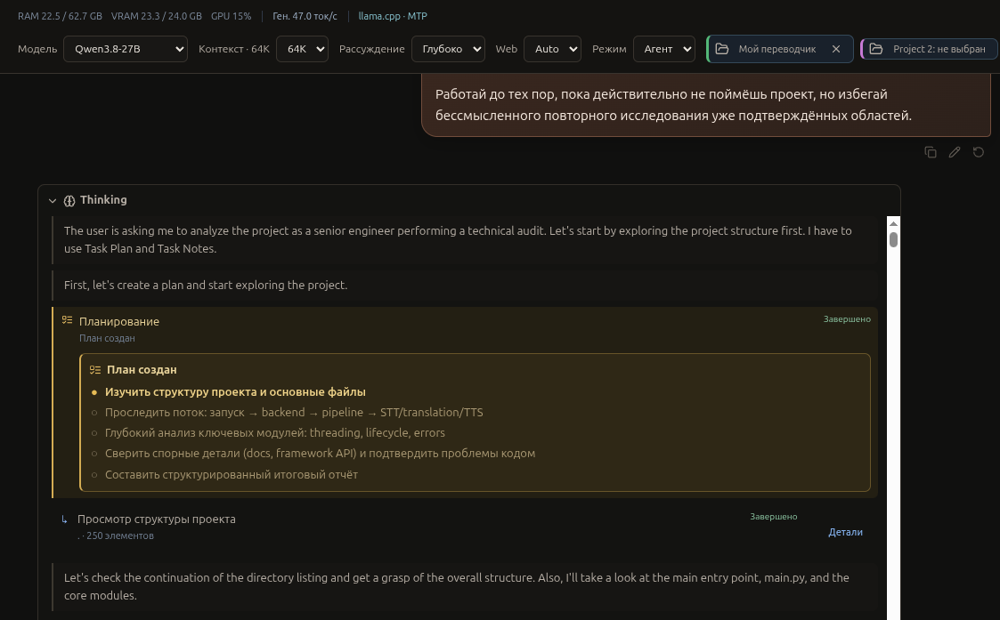
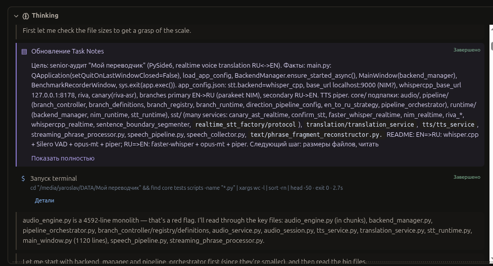
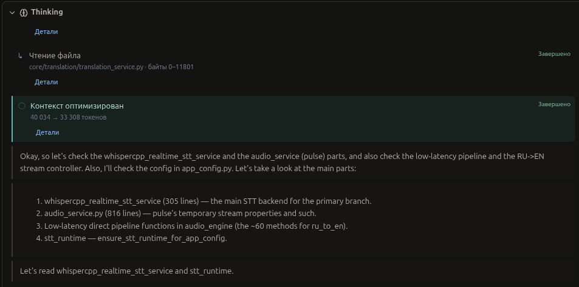
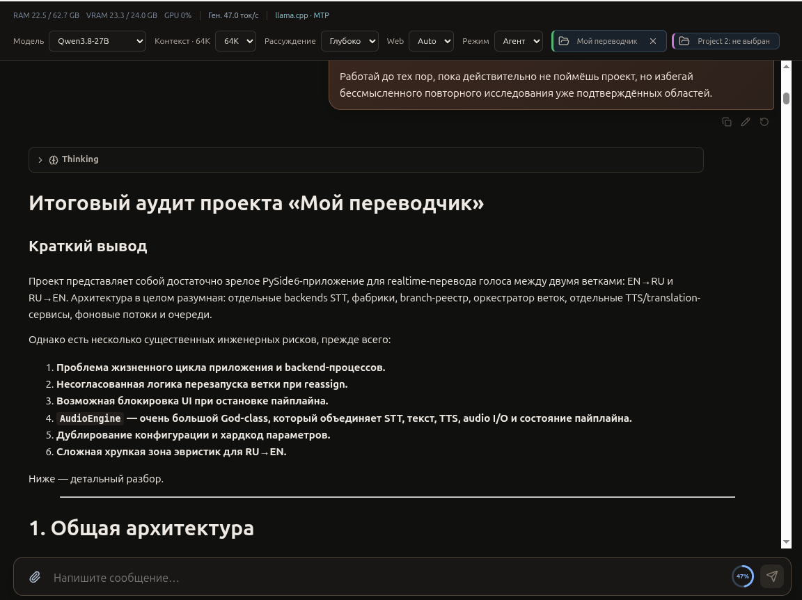
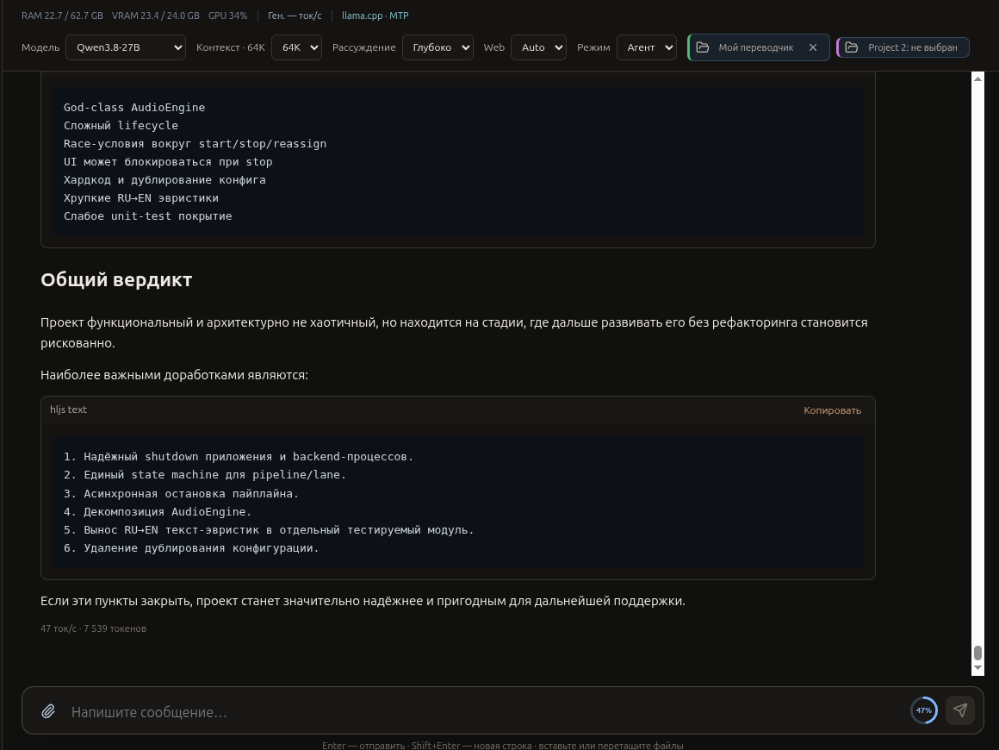

# Local AI Desktop

Локальный AI-клиент для Linux. Русскоязычный интерфейс чата и локального агента для моделей Ollama и llama.cpp; облачное API не требуется, весь инференс выполняется на собственной машине.

## Запуск

```bash
cd /media/yaroslav/DATA/local-ai-desktop
env NPM_CONFIG_CACHE="$PWD/local-cache/npm" npm run dev
```

Для собранной версии:

```bash
env NPM_CONFIG_CACHE="$PWD/local-cache/npm" npm run build
env NPM_CONFIG_CACHE="$PWD/local-cache/npm" npm start
```

На рабочем столе доступны три ярлыка; их запускные скрипты не используют системные каталоги для кэша приложения:

- **Local AI Desktop** — стандартный запуск, использует сервис Ollama. Скрипт: `run-local-ai-desktop.sh`.
- **Local AI Desktop — llama.cpp MTP** — собственный `llama-server` с Qwen (GGUF symlink на Ollama blob) и ускорением `draft-mtp`.
- **Local AI Desktop — GLM-4.7-Flash** — собственный `llama-server` с GLM-4.7-Flash (см. «Архитектура»).

Перед началом диалога через Ollama запустите сервис Ollama. Приложение использует три зарегистрированные локальные модели: `qwen3.8:27b-q4_K_M` и `gpt-oss:20b` (Ollama) и `glm-4.7-flash:q4_k` (llama.cpp). Ollama хранит веса через `OLLAMA_MODELS=/media/yaroslav/DATA/ollama`, GGUF для llama.cpp лежат в `/media/yaroslav/DATA/llama-models`; приложение подключается к `http://127.0.0.1:11434` и `http://127.0.0.1:8081` только как клиент. Qwen обрабатывает изображения нативно; выбранная модель без vision capability возвращает контролируемую ошибку без скрытой fallback-модели.

## Что реализовано

- Тёмный интерфейс на русском: список чатов сгруппирован по дате создания, у каждого диалога показана выбранная модель; доступны создание, переименование и удаление.
- История чатов в SQLite, Markdown, подсветка синтаксиса и копирование блоков кода. Для каждого диалога сохраняются дата создания, модель и последнее фактическое использование контекста.
- Реестр трёх локальных моделей: Qwen3.8-27B и gpt-oss-20b (Ollama), GLM-4.7-Flash (llama.cpp) — с человекочитаемыми именами, проверкой установки, точными квантованиями и динамическими пресетами контекста (от 16K до 256K в зависимости от модели).
- Потоковая выдача, отмена генерации, выгрузка предыдущей модели при переключении, запоминание модели, режима и рабочей папки для каждого чата.
- Круговой индикатор рядом с полем ввода показывает фактическое заполнение контекста из `prompt_eval_count`, его максимум и оставшийся запас. Цвет меняется при 60%, 80% и 90%.
- Режимы рассуждения `Fast / Deep` для моделей, которые их поддерживают. Процесс размышления отображается в таймлайне вперемешку с действиями инструментов: видно, когда модель думает, а когда вызывает инструменты.
- Переключатель «Чат / Агент»: в агентском режиме с рабочей папкой доступны чтение и поиск файлов, `apply_patch`, создание файлов, git inspection и контролируемый terminal. Диагностические команды запускаются сразу; рискованные получают явное подтверждение в приложении.
- Планирование: агент составляет план из шагов, отслеживает статус каждого и показывает план в интерфейсе.
- Task Notes: агент ведёт краткую рабочую заметку задачи — цель, найденные факты, решения, следующий шаг — и обновляет её по ходу работы. Заметка переживает компакцию контекста.
- Оптимизация контекста: при заполнении 60–90% выбранного контекста менеджер контекста сжимает историю и результаты инструментов в чекпоинт working memory, чтобы агент не терял нить задачи. В интерфейсе показывается фактическая экономия токенов.
- Вложения: локальное извлечение текста из docx, xlsx и pdf; изображения передаются в нативный vision выбранной модели. Модель без vision capability возвращает контролируемую ошибку без скрытой fallback-модели.
- Переключатель `Web: Off / Auto` настраивается для каждого диалога. В Auto локальная модель получает read-only web-инструменты: поиск, открытие и чтение страниц, переход по ссылкам и возврат назад.
- Каждая генерация имеет собственный ID и AbortController. Stop отменяет inference, web-session, agent loop и terminal process group; запоздалые события старой генерации игнорируются. Пользовательские сообщения можно редактировать: downstream история удаляется и ответ создаётся заново.
- Обновление RAM и показателей NVIDIA через лёгкий опрос `nvidia-smi` каждые две секунды. Когда драйвер или `nvidia-smi` недоступны, остаётся мониторинг RAM и понятный статус GPU.
- Верхняя панель разделяет вторичный runtime monitoring (RAM, VRAM, GPU и скорость generation) и основные controls. Скорость ответа после завершения берётся из `eval_count / eval_duration` Ollama; tooltip показывает доступные prompt/eval counters и TTFT. Во время streaming приложение не оценивает tokens по символам и ждёт authoritative runtime metric.
- Изолированный Electron renderer: `contextIsolation`, отключённый `nodeIntegration`, типизированный preload IPC. Доступ к SQLite, выбору папки, процессам и мониторингу остаётся в main process.

## Локальные модели

| Интерфейс | Бэкенд | Идентификатор | Точность | Контексты в UI |
| --- | --- | --- | --- | --- |
| Qwen3.8-27B | Ollama | `qwen3.8:27b-q4_K_M` | Q4_K_M | 16K, 32K, 64K, 128K, 256K |
| gpt-oss-20b | Ollama | `gpt-oss:20b` | нативные MXFP4 MoE-веса и BF16-тензоры | 16K, 32K, 64K, 128K |
| GLM-4.7-Flash | llama.cpp | `glm-4.7-flash:q4_k` | Q4_K | 16K, 32K, 64K |

Все три модели поддерживают инструменты и рассуждения. GLM-4.7-Flash работает на `llama-server` с нативным chat template, reasoning и OpenAI-совместимым tool calling.

Контекст передаётся Ollama на каждый запрос как `num_ctx`, а для llama.cpp приложение сверяет его с `n_ctx`, которые отдал `llama-server`. Output budget не зависит от Reasoning: для каждого запроса он составляет до 32K токенов и ограничивается фактически оставшимся местом context window с запасом 512 токенов. Перед каждым inference приложение делает однотокенный preflight через Ollama и получает фактический `prompt_eval_count`; для llama.cpp output budget резервируется до старта генерации. Если backend поддерживает независимый reasoning control, UI показывает `Fast` и `Deep`: Qwen3.8 и gpt-oss используют Ollama `think`, GLM-4.7-Flash через llama.cpp — `reasoning_effort` и `enable_thinking`. Для каждой генерации SQLite сохраняет reasoning mode, запрошенный и effective output, context/input tokens, число agent steps и finish reason.

Agent action budget — это soft budget на один generationId: базовый лимит 100 действий. Если задача продолжает продвигаться и не упирается в застой, бюджет расширяется шагами по 50, до абсолютного потолка 250 действий. При завершении плана или отсутствии прогресса у границы лимита агент не расширяет бюджет, а переходит к завершению работы.

## Web-доступ

Web работает через `playwright-core` и установленный Google Chrome в headless-режиме. На время одного ответа создаётся новый временный BrowserContext: он не использует профиль пользователя, аккаунты, cookies, историю, пароли или расширения; после ответа context и browser закрываются.

Поиск выполняет DuckDuckGo с SafeSearch=Strict через заменяемый интерфейс `SearchProvider`. Сервис разрешает только HTTP(S) навигацию методом GET/HEAD, блокирует скачивания, формы и все модели ввода/click. До навигации и после чтения применяются URL/domain и content-проверки adult, gambling и malicious/phishing; результат блокировки возвращается модели как структурированная ошибка. CAPTCHA, DNS/SSL, timeout и browser errors также возвращаются как ошибки инструмента, чтобы модель могла выбрать другой источник или честно сообщить о недоступности.

## Демонстрация

Скриншоты лежат в `assets/content`. Номера файлов соответствуют порядку сценария.



**1 — Схема приложения и roadmap.** Стек от UI к инференсу: Request/Context Builder → Working Memory/Context Manager → Agent Orchestrator (Planning, Task Notes, Control Logic) → Tools (Files, Terminal, Web, Safety) → Multimodal → Ollama / llama.cpp, плюс SQLite и planned-компоненты (MCP, Long-term Memory).



**2 — Общий вид приложения с пустым чатом.** Тёмная тема: слева список диалогов, сверху панель с моделью, контекстом и мониторингом RAM/VRAM/GPU, в центре приветствие.



**3 — Планирование.** Агент составляет план из шагов и показывает его статус; здесь — завершённый план и первый шаг.



**4 — Task Notes.** Агент обновляет рабочую заметку задачи (цель, факты, следующий шаг) и запускает terminal-команду в рамках её выполнения.



**5 — Оптимизация контекста.** Менеджер контекста сжал историю: `40 034 → 33 308` токенов, сохранив ключевое в working memory.



**6 — Начало аудита.** Старт генерации в режиме «Глубоко»: метрики (скорость, backend), режим Агент и начало структурированного ответа со списком рисков.



**7 — Конец аудита.** Финал ответа: общий вердикт и блок рекомендуемых доработок; счётчик показывает ~7500 токенов итогового ответа.

## Расположение файлов

Проект, `node_modules`, npm-кэш и сборка находятся в `/media/yaroslav/DATA/local-ai-desktop`.

Так как текущая точка монтирования DATA позволяет писать только в созданную рабочую папку, runtime-данные приложения находятся в её дочернем каталоге, а не в sibling-директории:

| Данные | Путь |
| --- | --- |
| SQLite | `runtime/sqlite/local-ai-desktop.db` |
| Electron user data | `runtime/app-data` |
| Кэш Electron | `runtime/cache` |
| Логи | `runtime/logs/application.log` |
| npm cache | `local-cache/npm` |
| GGUF-модели (llama.cpp) | `/media/yaroslav/DATA/llama-models` |

Таким образом, приложение не создаёт свои данные в `~/.config`, `~/.cache`, `~/.local`, `~/.npm` или на системном диске.

## Архитектура

`src/main` содержит Electron main process, SQLite, безопасный IPC, мониторинг и адаптеры LLM. `src/preload` предоставляет рендереру только явный API. `src/renderer` содержит React-интерфейс и Zustand-store. Общие типы находятся в `src/shared`.

Интерфейс `LlmBackend` поддерживает Ollama и launcher-managed `llama-server`. Ярлык **Local AI Desktop — llama.cpp MTP** запускает собственный Qwen server с `draft-mtp`, ждёт его health check и завершает только PID, который создал сам. Он использует символические имена на существующие Ollama GGUF blobs, не создавая вторую копию модели.

Ярлык **Local AI Desktop — GLM-4.7-Flash** запускает официальный `ggml-org/GLM-4.7-Flash-GGUF` в квантизации `Q4_K` (18,244,193,920 байт) на `llama.cpp` с контекстом 65,536 токенов. Для GLM включаются его нативный Jinja chat template, reasoning и OpenAI-compatible native tool calling; Qwen MTP и Ollama-модели используют прежние параметры.

SQLite хранит полную историю, а не KV-кэш модели. Поэтому сессии не создают отдельных постоянных контекстов в VRAM: при переключении чата для запроса передаётся сохранённая история активного чата. Это позволяет в дальнейшем держать загруженным только один inference context/model одновременно.

## Следующие этапы

1. MCP-подключение внешних инструментов (planned-компонент со схемы, п. 1).
2. Long-term Experience / Memory (planned-компонент со схемы, п. 1).
3. Lightweight Diff / Review UX (низкий приоритет).
4. Multi-Agent Mode (позже, самый сложный пункт).
