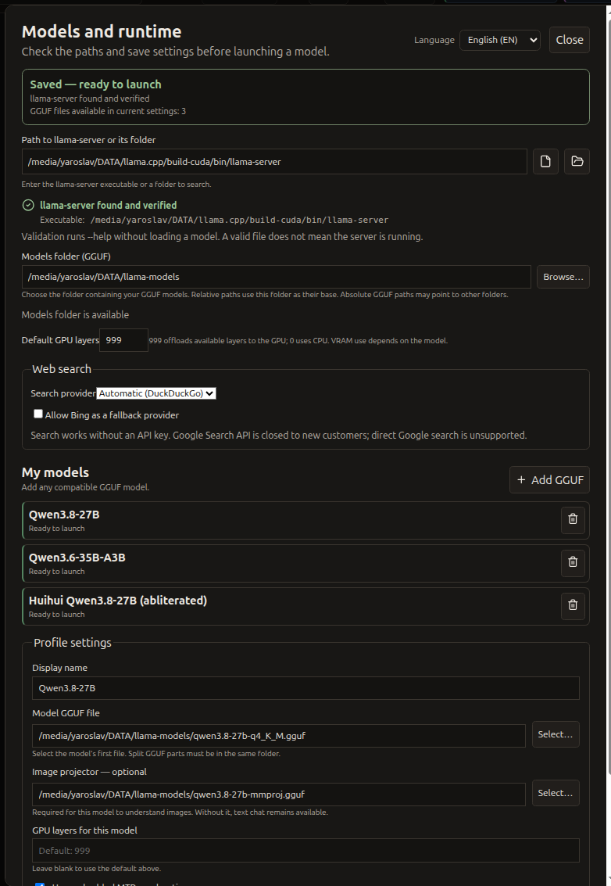

# Getting started

[English](GETTING_STARTED.md) · [Русский](../ru/GETTING_STARTED.md) · [Home](../../README.md)

## Platform and package status

**Verified:** The Local AI Desktop v0.1.0 Linux amd64 `.deb` was successfully installed and first-run smoke-tested on the developer's Ubuntu 24.04 x86_64 machine. After setup and UI fixes, the installed application was repeatedly tested with fresh, isolated XDG configuration, data, and cache profiles. The final test confirmed installation and launch, initial configuration, selecting and validating the `llama-server` executable, model selection, and successful application startup.

**Not verified:** Installation on a completely fresh operating system, other Linux distributions, other hardware configurations, or general compatibility. The package includes Electron and the Rust Agent runtime, but not `llama-server` or model weights. The repository build target is available with `npm run package:linux`.

The app is Linux-focused. Debian-family x64 is the current packaging target. Other distributions, ARM systems, GPU driver combinations, and desktop environments need individual validation. The author's development/test machine is an RTX 3090 with 24 GB VRAM, Ryzen 7 5700X3D, and 64 GB DDR4; this is not a minimum requirement.

## Install a published `.deb`

Download the Linux x86_64 `.deb` for **v0.1.0 — Experimental Alpha (Pre-release)** from [GitHub Releases](https://github.com/Kushch-Yaroslav/local-ai-desktop/releases), then install it on Ubuntu with:

```bash
sudo apt install ./local-ai-desktop_0.1.0_amd64.deb
```

Installation and first-run smoke testing were completed on the developer's Ubuntu 24.04 x86_64 machine; a completely fresh operating system and other Linux distributions have not been tested.

## Prepare llama.cpp and GGUF models

Install or build a llama.cpp version that provides a compatible `llama-server`. The app package does not provide this server or model weights. Runtime options can vary with llama.cpp builds, so a version that supports the requested model architecture, GPU backend, projector, and any MTP configuration is needed.

Open **Settings → Models and runtime**. In **Path to llama-server or its folder**, enter the executable or a folder containing it, including an ancestor of a nested llama.cpp build. You can browse for either a file or folder. The app validates the file or searches the supplied folder within fixed limits; if several executables are found, select one. Review the resolved executable and save before launching. Existing saved executable paths remain supported. Set the directory where your GGUF models are stored. Add a model with its GGUF file and any required vision projector; paths are user-provided. Save settings, then choose a model in the toolbar and launch it.



The default CPU/GPU layer value is `999`, which asks llama.cpp to offload as many model layers as it can to the GPU. A value of `0` asks it to run model layers on the CPU. These are requests to the backend; actual placement depends on the model, build, and hardware.

If the whole model does not fit in VRAM, you can configure partial offloading: some layers run on the GPU and the rest on the CPU, using system RAM for model data. This can make a larger model usable, often at a much lower speed. Partial offloading is an intentional configuration; it is different from an out-of-memory failure.

The author has not tested total VRAM/RAM exhaustion, and the app has no verified automatic recovery for it. Exhaustion may cause a model-load error, allocation error, or another runtime failure. If startup fails, reduce GPU layers or context, or try CPU execution.

## First session

1. Start the app and complete the runtime settings above.
2. Select a configured model and wait for the runtime status to become ready. Watch the RAM/VRAM indicators.
3. Start a **Chat** and send a simple prompt. For a vision test, attach an image only after selecting a model with supported image input.
4. For **Agent**, select a project and begin with a small read-only request such as summarizing the project structure. Review each requested approval before allowing changes or commands.

## Common problems

- **Server not found:** verify the executable path or `PATH`; check that the file is executable and matches your CPU architecture.
- **Model missing:** verify the model directory, filename, and GGUF integrity; model files are not downloaded automatically.
- **Out of memory or failed startup:** lower context size or GPU layers, disable optional MTP, or select CPU layers. A model's listed maximum context does not imply that your machine can allocate it.
- **Vision input rejected:** only models with a supported vision capability and compatible projector can process images. Image Processing CPU/GPU configures that image path, not the whole language model.
- **GPU not detected:** check that llama.cpp was built with the relevant backend and that the driver works. NVIDIA metrics require `nvidia-smi`; other GPU telemetry may be unavailable.
- **Package or desktop launch issue:** use the terminal to capture the exact error and check that the host satisfies the package dependencies. Electron sandbox setup varies by host.

See [User guide](USER_GUIDE.md) for controls and [Features](FEATURES.md) for behavior and limitations.
