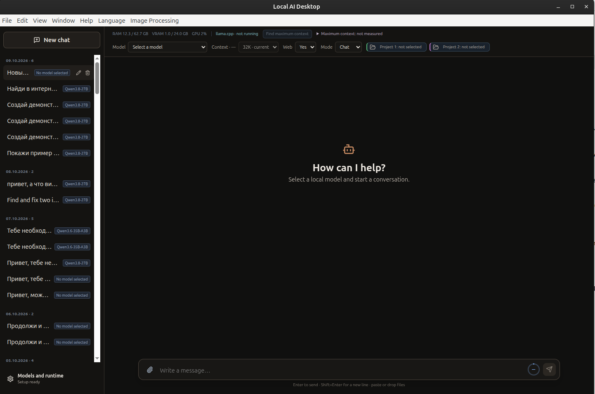
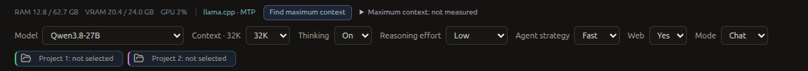
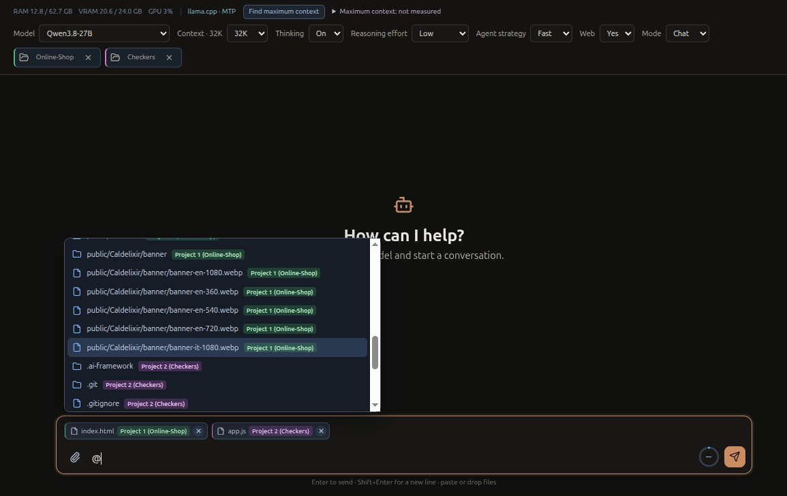
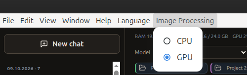
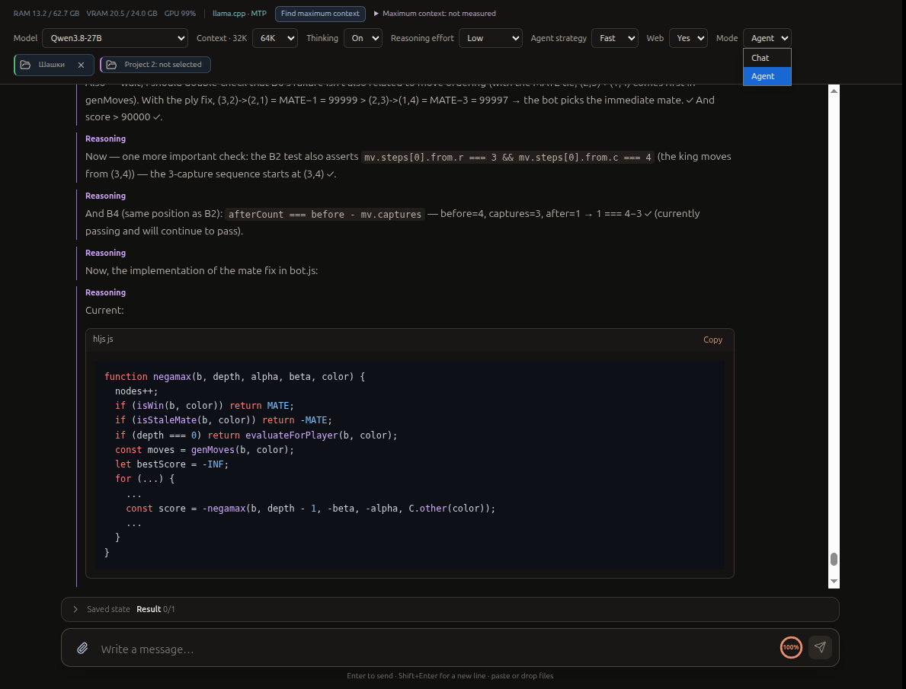
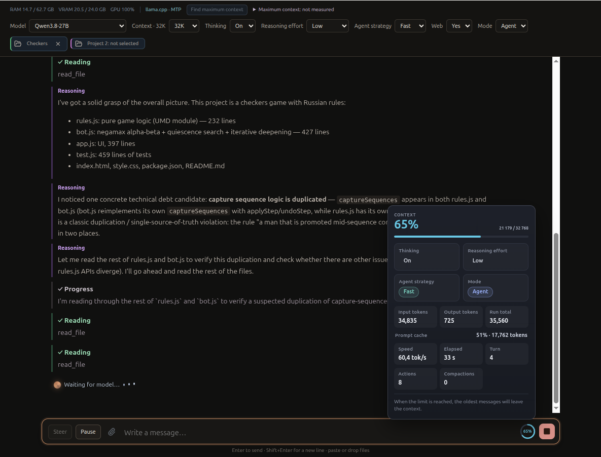
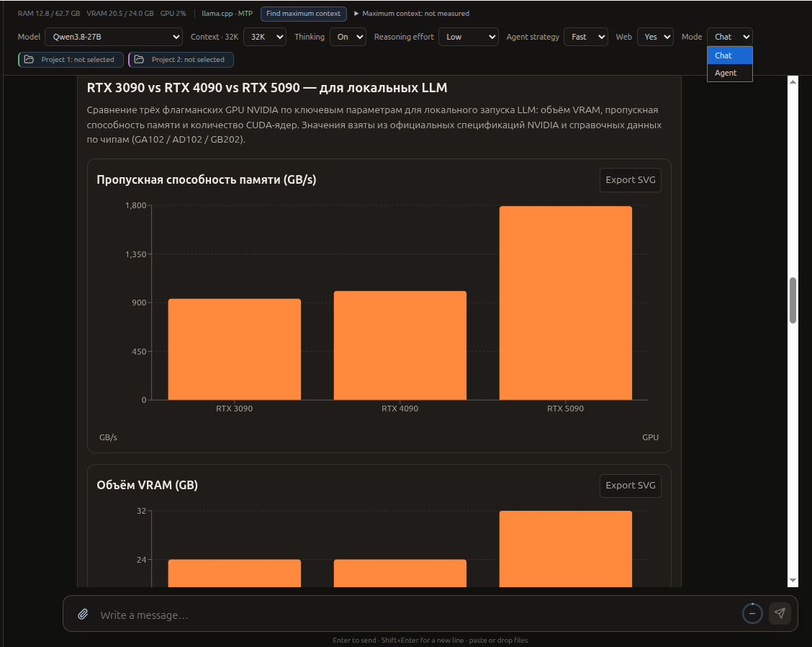

# User guide

[English](USER_GUIDE.md) · [Русский](../ru/USER_GUIDE.md) · [Home](../../README.md)

## Interface and chats

The sidebar contains chat history and controls for creating, selecting, renaming, and deleting conversations. Model, mode, project roots, context, reasoning, and web settings belong to each conversation. A running Agent task can continue while you open another chat; the sidebar marks the active run.

## Toolbar and runtime

Select a model from the toolbar. The runtime indicator reports llama.cpp status and supported speculative mode such as MTP. RAM, VRAM, GPU and generation metrics are shown when available; NVIDIA telemetry depends on `nvidia-smi`. MTP is runtime/model dependent and may be unavailable or disabled.

The context selector offers presets supported by the model and runtime; a preset does not guarantee that it will fit in memory. **Find Maximum Context** is described below. Thinking and Reasoning effort affect model-specific behavior only when supported. The Agent's **Fast/Deep** strategy is a separate control for how the Agent works.

**Chat** is direct conversation. **Agent** enables project and other configured tools. The conversation's **Web: Yes / No** setting controls whether web tools are available: Yes enables search and read-oriented page tools; No disables them. The implementation does not provide arbitrary browser interaction or form submission. Check returned sources and claims.

### Thinking and reasoning effort

Start with moderate reasoning effort for ordinary requests. Increase it when a task needs more analysis; the highest setting is not automatically better for every prompt.

### Qwen3.8 and xHigh reasoning

The author reports that Qwen3.8-27B with Thinking enabled and Reasoning effort at xHigh can spend a very long time reasoning. Some complex tasks have taken about an hour. This is an author observation, not a benchmark or a typical duration for all requests. A long reasoning phase does not by itself mean that the application is frozen. Check whether progress, tool activity, and runtime status continue to update. If there is no useful progress or the runtime reports a problem, treat that as a possible stalled or failed run. xHigh is not guaranteed to improve every answer; use lower or medium effort for everyday work.

## Projects and `@` references

Choose Project 1 and optionally Project 2. The interface supports at most two roots for a convenient cross-project workflow. Type `@` to select files and folders within those roots; selected references are attached to the message and displayed with project badges.

For example, select a UI library as Project 1 and an application as Project 2. Reference `@src/Button.tsx` in Project 1 and the matching page in Project 2, then ask Agent to compare the component and propose an integration. Review its plan, diff, and approvals before applying changes.

You can also type an absolute path such as `/media/user/another-project` in your message. In Agent mode, eligible paths explicitly supplied in user messages are resolved into additional workspace roots (up to four). Project file tools can use absolute paths within those roots; relative paths resolve against the primary selected project, or the first explicit root if no project is selected. Path filtering rejects system roots, shallow paths and some sensitive home directories. An explicit path does not become Project 1 or Project 2 and does not gain `@` autocomplete or a project badge. Mentioning a path deliberately extends the file-tool scope, so only provide paths you intend the Agent to access.

The terminal starts in the selected Project 1 root, or the first explicit root when no project is selected. Terminal commands may address other locations; a command classifier blocks some forms and requests approval for commands it cannot establish as safe. These boundaries do not make the Agent a sandbox. Review file changes and the exact command before allowing actions.

## Images, attachments, and Image Processing

Image Processing CPU/GPU selects the device for supported multimodal image processing. GPU can be faster and use more VRAM; CPU can conserve VRAM and be slower. It does not switch the language model between CPU and GPU. Image input requires a compatible vision model and projector.

Attachments include text and code files, PDF, DOCX, XLS/XLSX, CSV/TSV, and images. Text can be extracted locally; scanned PDFs may need OCR, which is not currently available. Structured spreadsheet/CSV rows can be read in bounded pages. Review attachment status and model capability before relying on its contents.

## Agent run controls and context

The Agent timeline can show reasoning, tool calls, progress, and waiting states. **Pause** is cooperative: the runtime receives the request at an Agent loop boundary. It does not cancel an in-flight model request or tool call; that work can finish before the pause takes effect. The Agent then enters a bounded checkpoint phase, where only checkpoint tools are available, records its state, returns a pause summary, and ends that run. There is no continuation of the same live generation. To continue, send a new message; it starts a fresh generation that can use the saved Task Notes and conversation history. The checkpoint helps continuity but cannot guarantee it.

**Stop** cancels the active generation and associated Agent execution, including related tool or terminal activity where supported. Cancellation is not an atomic rollback of changes already made. Text steering is also available during Agent runs: it can be accepted while the model is working and is delivered at a model-turn boundary. Chat mode does not offer the same mid-generation steering.

**Edit** changes an earlier user message, removes downstream conversation history, and starts a fresh generation from the edited point. **Regenerate** removes the downstream branch from the selected user turn and starts a new generation using the applicable conversation state. Neither continues the previous generation. Edit and Regenerate are unavailable while an incompatible active run exists; the UI and main process guard these operations.

The context indicator reports actual prompt usage when llama.cpp supplies it, alongside the configured maximum and remaining capacity. The expanded details include runtime token and memory estimates. Compaction can preserve useful state, but can lose details; it does not increase model capability.

## Find Maximum Context

This action estimates a safe context boundary for the currently selected and running model. It requires a launcher-managed llama.cpp runtime with enough measured allocation evidence. The application restarts llama.cpp for a bounded set of FP16 and Q8 KV-cache probes, checks startup and health, sends a probe inference, reads memory and allocation evidence, and restores the original configuration. It uses measured available memory, inferred growth between probe sizes, host-memory reserves, and VRAM budget safeguards; a saved result is checked against current memory before selection. This is a measured estimate with bounded search, not an exhaustive out-of-memory test or an absolute hardware maximum.

As a practical author policy illustration, on a 24 GB RTX 3090 roughly 1.5 GB of total VRAM may be left outside model/runtime allocation. If the desktop already uses around 800 MB, only about 700 MB may remain for other workloads. Those figures vary and are not a fixed allocation enforced by the feature. The code uses measured headroom and configurable safeguards, not a universal 1.5 GB formula.

A larger context can increase memory pressure and does not necessarily improve answer quality or system stability. Choose a size that fits the actual workload and leave room for the desktop and other processes.

## Rich Responses

Supported visual output includes KPI/metric cards, Recharts bar/line/area/pie/scatter charts, sortable tables, CSV download and copy, safe Mermaid diagrams, sourced image galleries, and combined rich reports. Charts and Mermaid diagrams can be exported as SVG. The interface validates structured artifact data; it does not make model-authored facts true. Review provenance and values.

More detail: [Features](FEATURES.md) · [Getting started](GETTING_STARTED.md).
