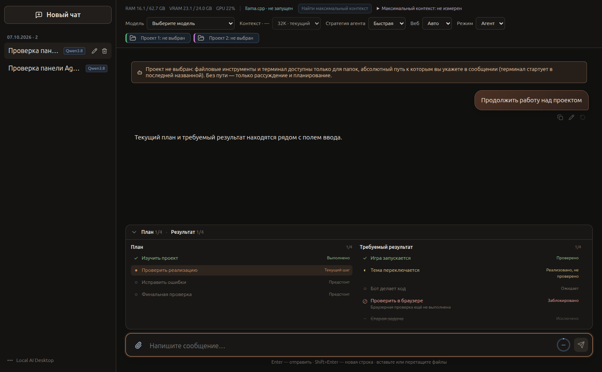
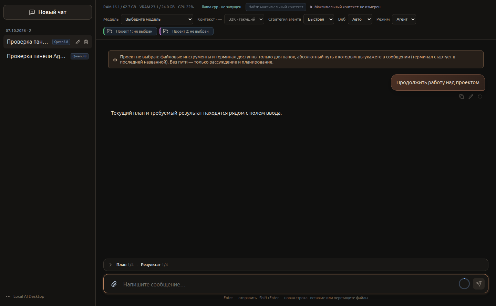

# Accepted V2 consolidation and Agent Status presentation

Initial branch `fix/devstral-agent-lifecycle`, clean HEAD `8101bc7d0029b0c1c3f65c3f31f443c930ca7787`.
`v2-migration` at `579b252` already included accepted Planning/Verification/Evidence (`c1b1ce7`) and model/Max Context work.
All local feature/fix branch heads were ancestors of the accepted current HEAD. Six commits remained to consolidate:
`42e0311`, `78cfc0b`, `e54d042`, `7b58741`, `7a2f698`, `8101bc7`.
Normal explicit merge `dbcf63c64b9568de7812c3f001a0168c1aceb6f1` preserves that history.
No model weights were added to Git. Generic external draft, startup selection, conversation normalization,
failed-run ownership, allocation parsing and discovery policy fixes remain intact.
`main` was not changed and nothing was pushed.

Phase 1 gates passed before creating `feat/v2-agent-status-ui`: 205 Rust unit tests, 66 integration tests,
all 35 current TypeScript source suites, four launcher/sandbox shell suites, frontend/Electron typechecks,
ESLint, cargo formatting and production build. Build retains the existing Vite large-chunk warning.

## Current panel

One collapsible Plan / Required Result panel sits directly above the composer. It uses the canonical
persisted per-chat AgentPlan/task-memory ledger and live task-memory IPC notifications. Main still saves
exactly the same ledger; forwarding the existing event is the only main-process presentation change.
There are no runtime, planning, verification, evidence, persistence-schema or completion-gate changes.
Legacy saved message/model-todo plans remain readable as a fallback when no canonical plan exists.
An explicitly empty canonical plan does not resurrect an older snapshot.

Successful `plan`/`deliverables` snapshot activities and per-message plan cards no longer create duplicate
chronological UI cards. Actual planning errors stay visible. Reasoning, project tools, terminal events,
steering, pause markers and failures keep their chronology and stable identifiers.

Completed/current/future/blocked plan steps have separate markers and accessible labels. Pending,
implemented (including legacy `done`), verified, blocked and dropped results remain distinct. Only
verified results count in the result numerator; dropped results are displayed but excluded from its total.
Labels use the existing centralized localization module. No runtime state values are translated.

The panel subscribes to chat identity/mode and its current projection, not token/clock updates.
Knowledge/evidence-only memory updates do not redraw an unchanged panel. Its bounded internal scroll
surface is outside the timeline. Collapse removes the full list DOM. Expanding/collapsing preference stays
with the panel while switching chats; all displayed data follows the selected chat's view. Completion,
failure, pause, Continue, compaction and reopening use the same canonical state.

## Evidence and checks

- 205 Rust unit tests and 66 integration tests: pass. Sandbox-only integration attempts could not bind their
  localhost fixtures; the full suite was rerun successfully on the host, with no test changes.
- All 36 current TypeScript source suites: pass, including the new Agent Status projection/store/SSR suite.
- Production IPC + real Rust scripted-provider regression additionally performs a plan tool call, forwards
  its canonical live task-memory event, persists it and preserves it through a subsequent HTTP 500.
  The pre-existing initial HTTP-500/new-chat recovery check is retained.
- Four launcher/sandbox suites: pass.
- Frontend typecheck, Electron typecheck, ESLint, cargo fmt --check, production build: pass.
- `node scripts/agent-status-renderer.test.mjs`: production Vite build in real Chromium, with a deterministic
  preload/provider fixture; live plan/results, collapse/expand, 60 suppressed snapshot events, preserved
  reasoning/terminal events, follow-scroll, scrolled-up reader, chat switching, Continue, completion/failure,
  localization all pass. No model is launched. This is renderer validation, not an inference claim.
- Real Electron production app in isolated runtime/SQLite: saved canonical plan/results open correctly,
  collapse/reload works and startup selector stays `Выберите модель`. Existing unrelated user Gemma process
  PID 71663 was already running; isolated startup neither created nor changed a GPU model process.
  No user's running app/model was stopped for this UI phase.

Expanded screenshot: 
Collapsed screenshot: 

Reproducible UI gate: `npm run test:agent-status` (Chromium defaults to `/usr/bin/google-chrome`, override
with `LOCAL_AI_TEST_BROWSER`; requires a host that permits local browser processes).
Raw ignored logs/screenshots reside in `runtime/validation/v2-status-moe/`.
